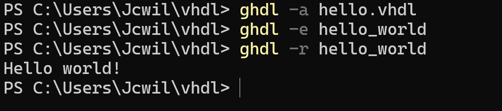
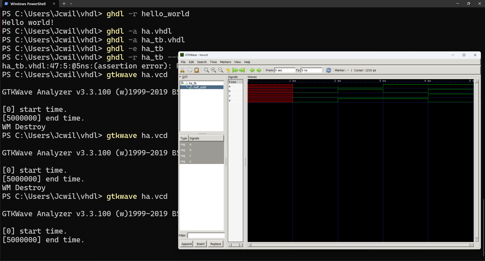
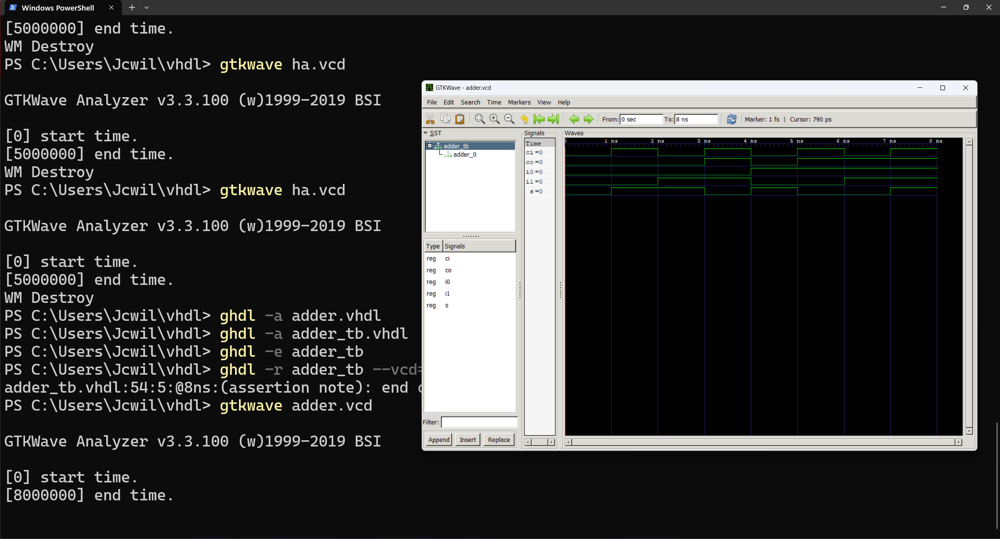
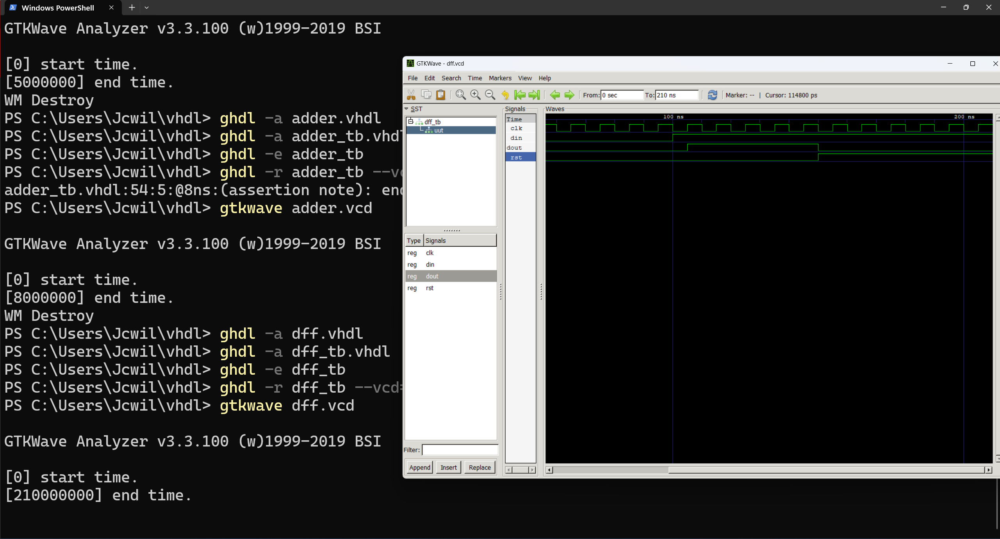
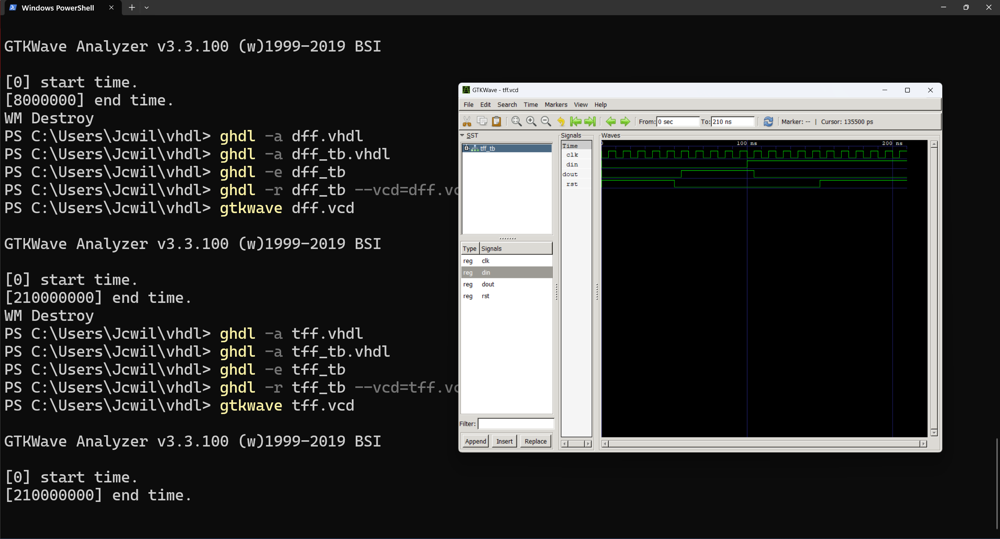
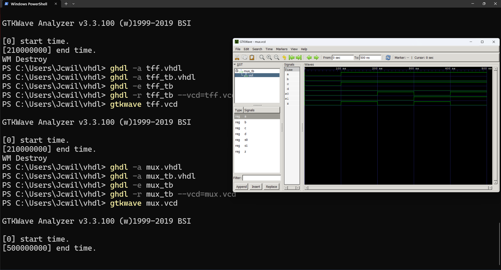
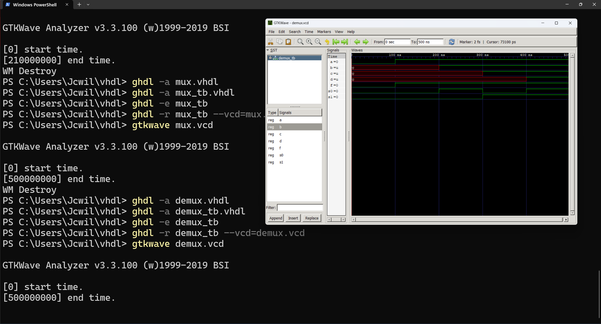

# CPE 322 - Lab 7

### Hello World

### Halff Adder

### Full Adder

### D Flip-Flop

### T Flip-Flop

### 4-to-1 Multiplexer

### 1-to-4 Demultiplexer

### SR Flip-Flop

### 8-bit Square Root

