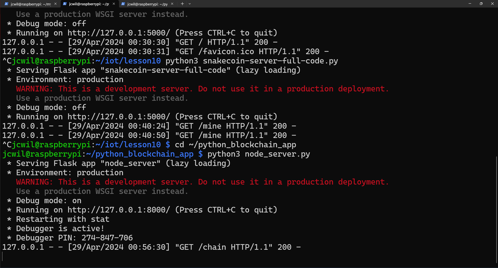
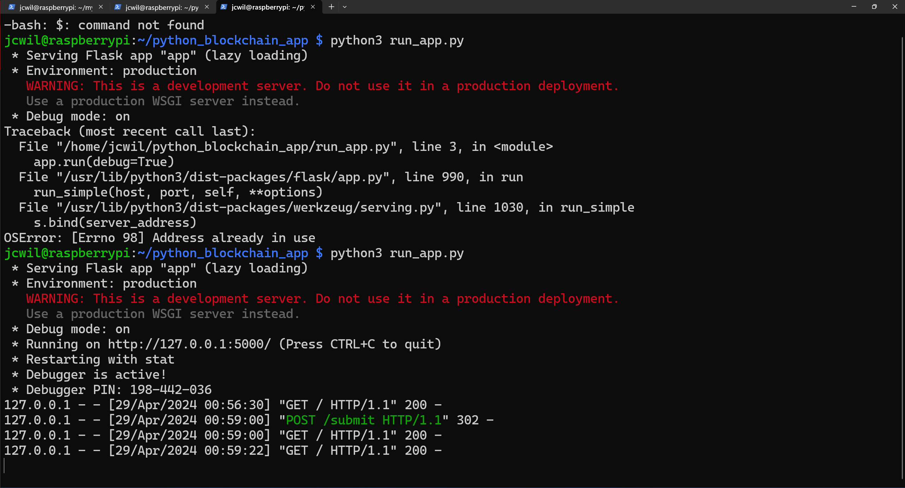
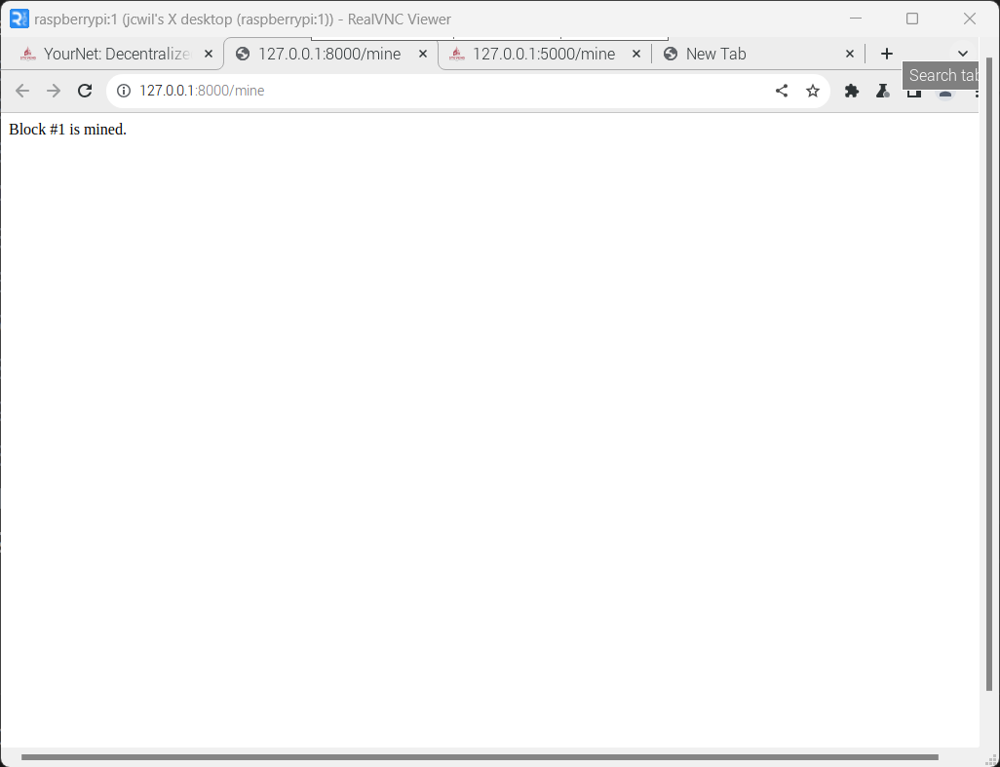
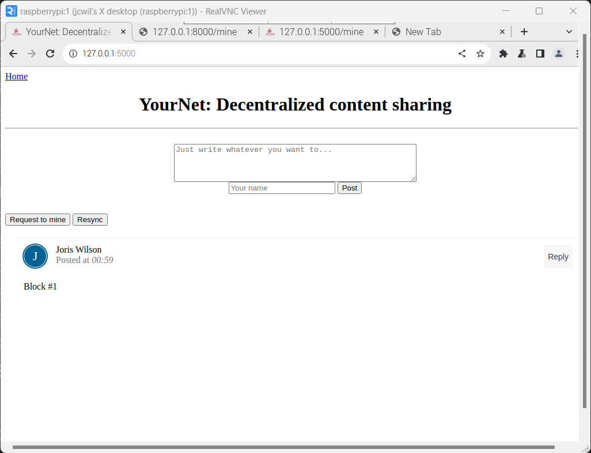

### Command: python3 hash_value.py`

### Command: python3`

### Command: python3 snakecoin.py`

### Command: python3 snakecoin-server-full-code.py`
- Terminal 1

### Command: python3 snakecoin-server-full-code.py`
- Terminal 2

### Command: python3 node_server.py`

### Command: python3 run_app.py`

### /mine page

### Post/reply
